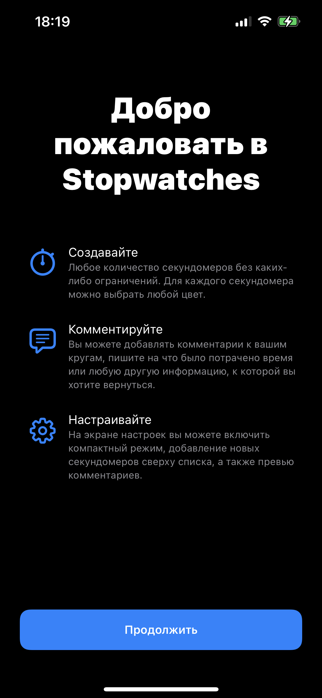

[](https://developer.apple.com/swift)
[](https://developer.apple.com/ios)

# RKWelcomeScreen

Пакет для рендеринга приветственного экрана, как у Apple.



# Пример использования

Чтобы создать экран требуется проинициализировать его моделью данных и шириной экрана. 

От ширины зависят отступы, чтобы на маленьких экранах с шириной меньше `375` отступы не были большими.

```swift
let model = RKWelcomeScreenViewController.Model(
    title: "Welcome to\nStopwatches",
    items: [
        .init(
            icon: UIImage(), 
            title: "Создавайте", 
            text: "Создавайте любое…"),
        .init(
            icon: UIImage(), 
            title: "Комментруйте", 
            text: "Вы можете добавлять …"),
        .init(
            icon: UIImage(), 
            title: "Настройте", 
            text: "На экране настроек …"),
    ],
    button: ("Продолжить", { print("Okay") }),
    appearance: .init(
        titleColor: .label,
        itemTitleColor: .label,
        itemTextColor: .secondaryLabel,
        backgrounColor: .systemBackground,
        tintColor: .systemBlue,
        buttonColor: .systemBlue,
        buttonTextColor: .white
    )
)

let welcomeViewController = RKWelcomeScreenViewController(model: model, width: 375)
present(welcomeViewController, animated: true, completion: nil)
``` 
